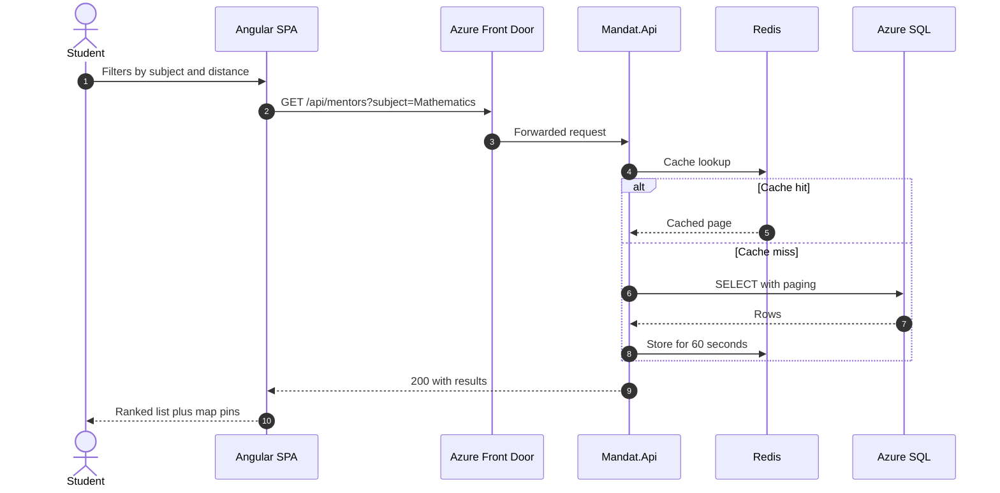
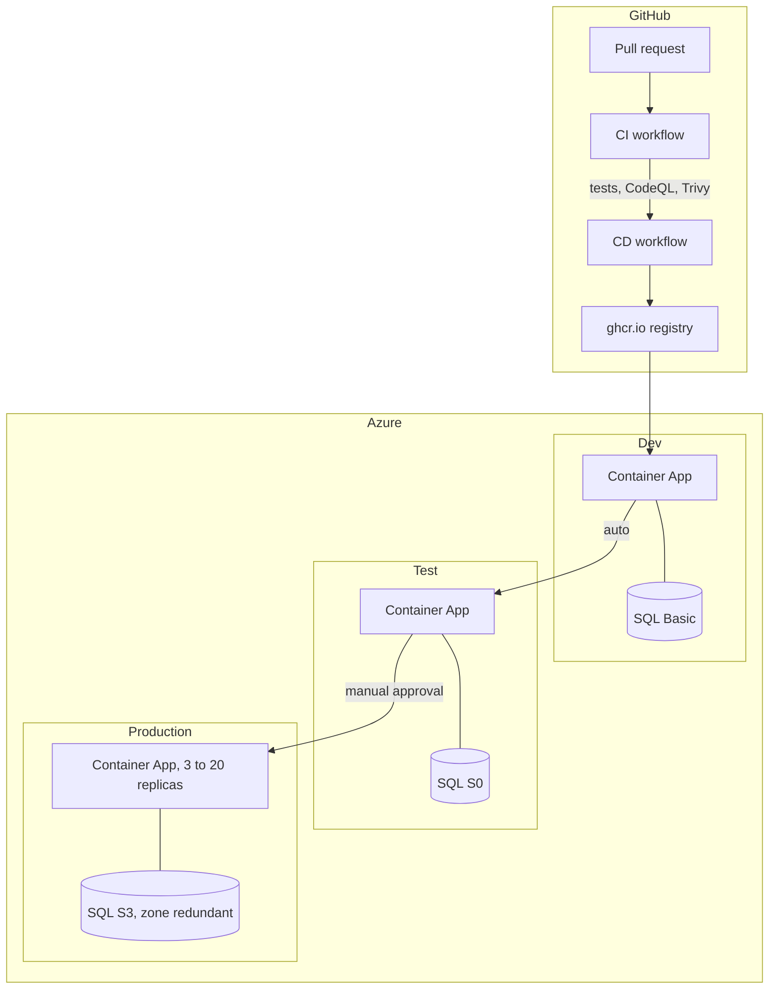
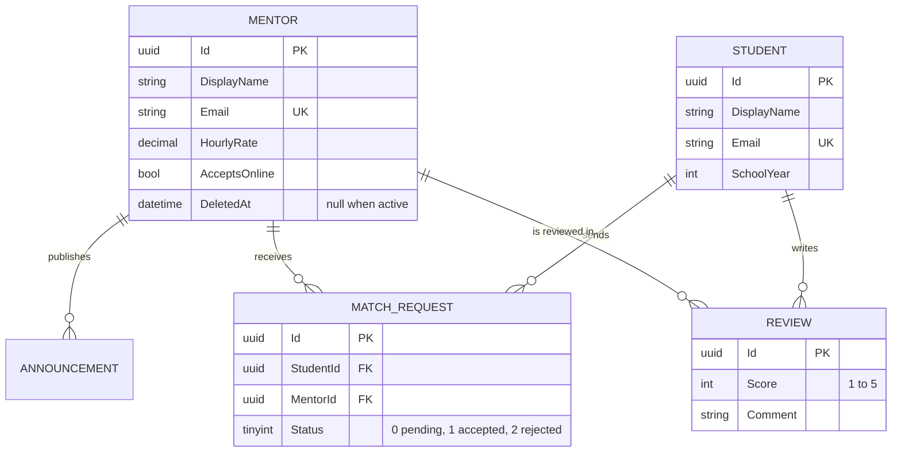
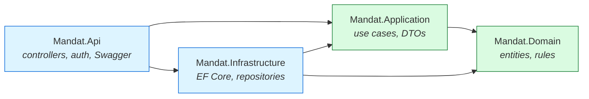

# Architecture

## How a mentor search request flows

## Deployment topology

## Domain model

## The layers, and what is allowed to reference what

`Mandat.Domain` references nothing. If you find yourself wanting to add a package reference to
it, the logic probably belongs in `Mandat.Application` instead.
